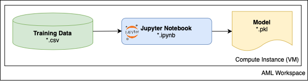

# Challenge 1: Create your Development Environment

The data science team has been experimenting with the *safe driver prediction* data and produced a Jupyter notebook that trains a model and evaluates its predictive performance. It's important the team understands what the machine learning code is doing and how it functions in a local compute environment.  To make things simple and easier to reproduce you'll create and utilize an Azure Machine Learning *compute instance* that you can use as a cloud workstation to run the notebook code.

**NOTE:** For simplicity of this challenge, this notebook doesn't take care of class imbalance, missing values, encoding categorical features, feature selection, or normalizing features.

## Prerequisites

Before starting this challenge, ensure you have the following prerequisite requirements in place:

* A Microsoft Azure subscription.
* Clone the [Git repo containing the OpenHack files](https://dev.azure.com/csedevops/_git/DSDevOpsOH).
* Download the Porto Seguro training data - your coach will give you the link.

## Recommended Reading

* [What is an Azure Machine Learning workspace?](https://docs.microsoft.com/azure/machine-learning/concept-workspace)
* [What is an Azure Machine Learning compute instance?](https://docs.microsoft.com/azure/machine-learning/concept-compute-instance)

## Challenge

As a team, complete the following tasks:

1. Create a **Machine Learning** resource in your Azure subscription - this is a fully managed cloud service used to train, deploy, and manage machine learning models at scale. This will create an Azure Machine Learning *workspace* and some related resources.
    * After creating your workspace in the [Azure portal](https://portal.azure.com), switch to new Azure Machine Learning Studio (Preview) experience and use the web-based notebooks interface to work with it.
2. To run your notebooks in the workspace, create a **Compute Instance** and wait for it to start.
3. Open the ***Jupyter*** (not Jupyter Lab) environment link for your compute instance.
    * If you have not worked with Jupyter before, have a look at [Jupyter Notebook for Beginners: A Tutorial](https://www.dataquest.io/blog/jupyter-notebook-tutorial/).
4. Download and extract the OpenHack files to your local machine.
5. In the Jupyter web interface for your compute instance, open the **Users** folder and upload the following files in the following structure:

    * porto_seguro_safe_driver_prediction_LGBM.ipynb
    * data
        * porto_seguro_safe_driver_prediction_input.csv

6. In the Jupyter web interface for your compute instance, navigate to **Kernel** in the menu bar and change Kernel to **Python 3.6 - AzureML**
7. In Jupyter, open the **porto-seguro-safe-driver-prediction-LGBM.ipynb** notebook, and run the code it contains to train and validate the insurance claim classification model. Verify that a trained model file (*.pkl) was created.

### Success Criteria

To successfully complete this challenge, you must:

* Provision an Azure Machine Learning workspace and compute instance.
* Run the experimentation notebook in your Azure Machine Learning compute instance and show your coach the trained model (*.pkl) file.
* Discuss the following questions with your coach:
    * What benefits and challenges can you see in using an Azure Machine Learning workspace as a central place for data scientists and developers to collaborate on machine learning code?
    * What benefits and challenges can you see in using Jupyter Notebooks as a development interface for model training code - particularly in respect to automating training processes?

### Resources

* [Basic vs. Enterprise version of Azure Machine Learning Workspace](https://docs.microsoft.com/en-us/azure/machine-learning/overview-what-is-azure-ml#sku)
* [How Azure Machine Learning differs from Machine Learning Studio (classic)](https://docs.microsoft.com/en-us/azure/machine-learning/compare-azure-ml-to-studio-classic)
