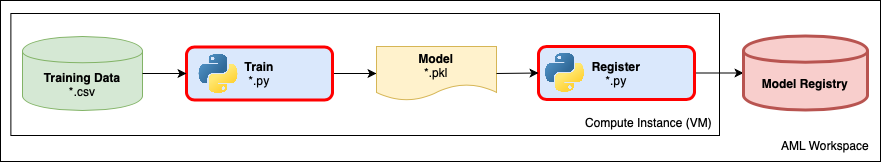

# Challenge 2: Refactor Model Training Code

Now you can successfully reproduce the safe driver prediction model using the notebook. The team would like to continue to ensure quality and improve the model code as well as centrally share models and results with others during development.  All of these goals are challenging with the training code embedded in a notebook and no centralized services are being utilized to facilitate sharing.  

What can be done to help the team with these goals?  
Extracting the notebook code into Python scripts is an important step to ensure code quality via lint and unit tests and also clean execution on remote compute targets (covered in challenge 3).  
Logging parameter values and model validation metrics centrally with the Azure Machine learning service makes it easy to compare the performance of different versions of the model and the parameters they were trained with.

In this experimentation phase your data scientists might want to execute many experiments with hyper-tuned parameters or configurations, so execution against 'remote' compute can save the team a bunch of time to find the best model while easily sharing results.

## Prerequisites

Before starting this challenge, ensure you have the following prerequisite requirements in place from Challenge 1:

* An Azure Machine Learning workspace with a compute instance
* The Challenge 1 experimentation notebook
* The Challenge 2 experimentation notebook

## Challenge

As a team, complete the following tasks:

1. Refactor the code from the Challenge 1 notebook into a python script by completing the commented (`## TODO`) sections of the `train.py` cell in the Challenge 2 notebook.
1. Ensure the provided unit tests pass with `pytest`
1. Make the `train.py` amd `test_train` files pass linting with `flake8`.
1. Complete and run the remaining sections of the Challenge 2 notebook. This notebook runs the training script as an experiment and enables you to review the outputs generated by the experiment run in [Azure Machine Learning studio](https://ml.azure.com). The outputs should include the experiment run log files and the trained model.
    * Specify a **'local'** compute target for running your experiment which will run against the existing Compute Instance. In production, you would likely use a remote training cluster (to which the entire experiment folder would be copied automatically when the experiment is run), but remote compute can take a while to initialize so testing locally with this relatively small volume of data is generally quicker.
    * Log the **AUC** [(Area under the curve)](https://towardsdatascience.com/understanding-auc-roc-curve-68b2303cc9c5) evaluation metric in the experiment run, as well as each of the parameter values used to train the model.
1. View the **learning_rate** parameter in the configuration file, execute a run against Azure ML compute to train the model, and verify that the metrics are logged.  Change the **learning_rate** value and then execute another run and see the values changed in the Azure ML service.
1. Register the model using the provided notebook code in your Azure Machine Learning workspace  - using tags to record the **AUC** metric in the registration.

### Hints

* To open a terminal (command prompt) in Jupyter, click the "New" button on [the notebook dashboard](https://jupyter-notebook.readthedocs.io/en/stable/examples/Notebook/Notebook%20Basics.html#The-Notebook-dashboard) and select "Terminal".
* To connect to your workspace from the Jupyter environment, best practice when using the Azure ML SDK is to use the `Workspace.from_config()` method to read the connection information from a workspace configuration file. On compute instances in your workspace, this file is created automatically. When using your own development environment, you must create this file in the same folder as your code. See [Configure a development environment for Azure Machine Learning](https://docs.microsoft.com/azure/machine-learning/how-to-configure-environment#workspace) for details.

### Success Criteria

To successfully complete this challenge, you must:

* Have a fully functional challenge 2 notebook which:
    * Successfully runs your experiment on Azure Machine Learning and can see the logged AUC metrics and trained model in the run results using two different parameter configuration values.
    * Successfully registers the trained model and tags the model with the AUC metric.
* Demonstrate that the unit tests pass against the Python training code using pytest
* Use `flake8` to demonstrate that train.py and test_train.py conform to the PEP 8 style guide for python code.
* Discuss the following questions with your coach:
    * What is the benefit of separating the training code out of the notebook?
    * What is the benefit of running your experiments using Azure Machine Learning?

### Resources

* [Notebook: Training Models](https://github.com/MicrosoftDocs/mslearn-aml-labs/blob/master/02-Training_Models.ipynb)
* [Documentation - How to monitor Azure ML experiment runs and metrics](https://docs.microsoft.com/azure/machine-learning/how-to-track-experiments)
* [*Microsoft Learn* module - Train a machine learning model with Azure Machine Learning](https://docs.microsoft.com/learn/modules/train-local-model-with-azure-mls/index)
* [Documentation - Train models with Azure machine Learning](https://docs.microsoft.com/azure/machine-learning/concept-train-machine-learning-model)
* [Documentation - How to build scikit-learn models at scale with Azure Machine Learning](https://docs.microsoft.com/azure/machine-learning/how-to-train-scikit-learn)
* [Improve code quality with linting via flake8](https://medium.com/python-pandemonium/what-is-flake8-and-why-we-should-use-it-b89bd78073f2)
* [Automatically format Python code using autopep8](https://pypi.org/project/autopep8/)

## Explore Further

In this solution, you used a local data file to train the model. To increase scalability and flexibility, you can store this data centrally in an Azure Machine Learning *datastore*, and you can create a *dataset* to simplify data ingestion and enable data versioning. See the following resources for more information:

* [Documentation - How to access data in Azure storage services](https://docs.microsoft.com/azure/machine-learning/how-to-access-data)
* [Documentation - How to create Azure Machine Learning datasets](https://docs.microsoft.com/azure/machine-learning/how-to-create-register-datasets)
* [Documentation - How to train with datasets](https://docs.microsoft.com/en-us/azure/machine-learning/how-to-train-with-datasets)
* [Documnetation - How to deploy and where to connect to your workspace](https://docs.microsoft.com/en-us/azure/machine-learning/how-to-deploy-and-where#connect-to-your-workspace)
