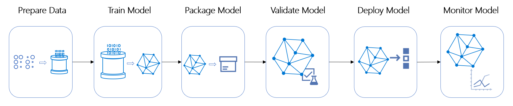
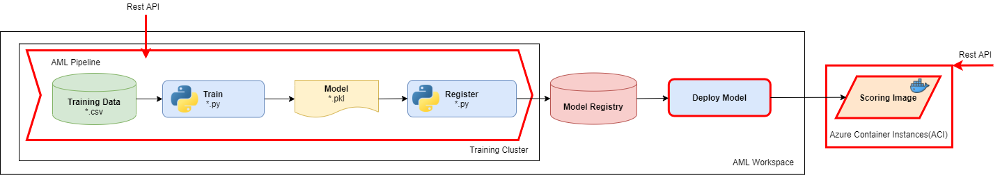

# Challenge 3: Azure Machine Learning Pipelines and Real-Time Inference

You just transformed the experimental notebook into a python script that can be managed and run independently of the notebook. You used the script to train the model, then you used code in the notebook to register the model that the script produced.

 Your team would like to have the training, registration, or future steps such as evaluation be easily reproduced and increase the speed and scale of those steps being executed. To achieve this objective, you'll encapsulate both model training and model registration as steps in an Azure ML pipeline which utilizes provisioned on-demand scalable Azure compute targets. The Azure compute target optimizes the time spent running training with a full set of data and can scale down to no cost when the job is done.

In order to improve their insurance application approval software, the team would also like a real-time prediction of the likelihood that a driver will file a claim.  To accomplish this objective, you'll deploy the registered model as a real-time inferencing service using the provided model scoring script.



## Recommended Reading

* [Documentation - What are Azure Machine Learning pipelines?](https://docs.microsoft.com/azure/machine-learning/concept-ml-pipelines)
* [Documentation - How to create your first Azure ML Pipeline](https://docs.microsoft.com/azure/machine-learning/how-to-create-your-first-pipeline)
* [Documentation - How to debug and troubleshoot machine learning pipelines](https://docs.microsoft.com/azure/machine-learning/how-to-debug-pipelines)

## Challenge

### Part 1: Create an Azure ML Pipeline

As a team, complete the commented (## TODO) sections of the provided Challenge 3 - Part 1 notebook to create an Azure ML pipeline that trains and registers the model. The pipeline should run on a training cluster compute target in your Azure ML workspace. Use the [Creating an Azure Machine Learning Pipeline](https://github.com/MicrosoftDocs/mslearn-aml-labs/blob/master/05-Creating_a_Pipeline.ipynb) notebook as a reference to help complete this section.

Prepare your Azure ML workspace with the following steps:

* Create an Azure ML compute target on which to run the pipeline and its steps.
    * To avoid automatic scale down of Azure ML managed compute the training compute option **Idle seconds before scale down** has been set to 1800. This can save time between pipeline runs if you are frequently debugging AML pipelines, but in a production scenario you would likely not set this in order to save compute costs.
    * [Documentation - What are compute targets in Azure Machine Learning?](https://docs.microsoft.com/azure/machine-learning/concept-compute-target)

### Part 2: Deploy an Inferencing Service

As a team, deploy the model that was trained and registered by your Azure ML Pipeline.

Use the [Creating a Real-Time Inferencing Service](https://github.com/MicrosoftDocs/mslearn-aml-labs/blob/master/06-Deploying_a_model.ipynb) notebook as a starting point for the code to deploy the model.

1. Adapt the code in the sample notebook to:

    * Retrieve the most recent version of the registered insurance claim prediction model.
    * Create a *Conda dependencies* file that includes the Python packages required by your scoring script.
    * Use the *scoring script* provided in the **Challenge03** folder of the OpenHack files. This includes an **init** function that loads the registered model, and a **run** function that uses it to predict claim classifications for new driver data.

2. Run the code in a notebook to retrieve the registered model and deploy it as an inferencing service to an Azure Container Instance (ACI).
    * Deploy the insurance claim prediction model as an ACI service, with the scoring script and conda dependencies you defined previously.
    * Check for the ACI container logs if service deployment takes longer than expected.

    [Documentation - How to deploy models with Azure Machine Learning](https://docs.microsoft.com/azure/machine-learning/how-to-deploy-and-where)

    [*Microsoft Learn* module - Deploying machine learning models with Azure Machine Learning](https://docs.microsoft.com/learn/modules/register-and-deploy-model-with-amls/index)

3. Test the deployed service by submitting a REST request to its endpoint and review the predictions it returns.
    * Use the following test data in numpy array format. This represents details for two drivers, for which your service should predict the likelihood of an insurance claim.

    ```Python
    [[0,1,8,1,0,0,1,0,0,0,0,0,0,0,12,1,0,0,0.5,0.3,0.610327781,7,1,-1,0,-1,1,1,1,2,1,65,1,0.316227766,0.669556409,0.352136337,3.464101615,0.1,0.8,0.6,1,1,6,3,6,2,9,1,1,1,12,0,1,1,0,0,1],
    [4,2,5,1,0,0,0,0,1,0,0,0,0,0,5,1,0,0,0.9,0.5,0.771362431,4,1,-1,0,0,11,1,1,0,1,103,1,0.316227766,0.60632002,0.358329457,2.828427125,0.4,0.5,0.4,3,3,8,4,10,2,7,2,0,3,10,0,0,1,1,0,1]]
    ```



### Success Criteria

To complete this challenge, you must:

* Successfully run your Azure ML pipeline which trains the model, log the AUC metric, and registers the trained model.
* Successfully deploy the trained model as a service and test its endpoint.
* Discuss the following questions with your coach:
    * What are the benefits of splitting the ML process into steps?
    * What are the benefits of publishing an Azure ML pipeline as a REST service?
    * What other steps might you include in an Azure machine learning pipeline?
