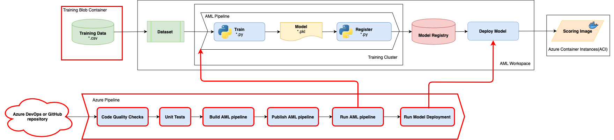

# Challenge 4: Training from a DevOps Pipeline

Your team now understands and has implemented the fundamental concepts in a local development "execute-from-my-notebook" experience and needs to apply all of these concepts to a production-ready workflow.  A notebook is convenient for experimentation, but is not suited for automating a full workflow. This is where Azure DevOps comes in. Using Azure Pipelines to operationalize Azure ML pipelines enables powerful tools such as version management, model/data validation, model evaluation/selection, and staged deployments to QA/production. Your team will take the learnings and relevant python scripts from the previous challenges and apply them to a new MLOpsPython code template to achieve these objectives.

* The word 'pipeline' has started to take on multiple meanings - make sure you don't get pipeline types mixed up. See [here](https://docs.microsoft.com/azure/machine-learning/concept-ml-pipelines#which-azure-pipeline-technology-should-i-use) for a description of the pipeline types. For clarity, these challenges are referring to 'Azure Pipelines' as 'DevOps pipelines'.

## Recommended Reading

* [Key concepts for new Azure Pipelines users](https://docs.microsoft.com/azure/devops/pipelines/get-started/key-pipelines-concepts?view=azure-devops)
* [*MLOpsPython* - templates to create Azure DevOps CI/CD pipelines for Azure ML](https://github.com/microsoft/MLOpsPython)
* [Azure Pipelines YAML schema reference](https://docs.microsoft.com/azure/devops/pipelines/yaml-schema?view=azure-devops&tabs=schema)
* [Machine Learning extension for Azure DevOps](https://marketplace.visualstudio.com/items?itemName=ms-air-aiagility.vss-services-azureml)

## Challenge

As a team follow the [bring your own code guide](https://github.com/microsoft/MLOpsPython/blob/master/docs/custom_model.md) to integrate your existing Python code for the safe driver model with the MLOpsPython repository structure. For the purposes of the OpenHack:

* Use Azure DevOps to host your code instead of GitHub.
* You do not need to create a parallel batch scoring pipeline.
* You do not need to complete the optional steps under 'Further Exploration'.

Follow the instructions in the same order as the guide.  Below are some specific tips to help things go smoother for some of the sections of the guide.

### Convert your ML experimental code into production ready code

* You should be able to use your existing linted and unit test passing Python code from the previous challenges.

### Replace training code

* You may need to modify the import statements in the test files to ensure the path to the code being tested is correct.

### Update evaluation code

* Set the DevOps pipeline variable ```RUN_EVALUATION``` to false. Evaluation will be explored in a later challenge.

### Customize the build agent environment

* Add ***lightgbm*** package to the dependencies and ***azureml-dataprep*** package to the pip dependencies in the conda dependencies yml file.
* Use the mcr.microsoft.com/mlops/python:openhack Docker image instead of mcr.microsoft.com/mlops/python:latest

### Replace score code

* You should be able to use the existing linted and functional `score.py` file from the previous challenge.



## Success Criteria

To successfully complete this challenge, you must demonstrate:

* Set up a branch policy ensuring that any code change submitted as a PR passes unit tests and linting before being merged to the master branch (hint: there is a PR yaml file in the .pipelines directory)
* An Azure DevOps CI/CD pipeline that:
    * Has a policy to prevent any unreviewed code changes from being committed to the master branch prior to successful linting and unit test runs.
    * Runs the code quality tests (linting) and unit tests prior to publishing the Azure ML training pipeline. The test results are available in Azure DevOps UI. The CI pipeline fails if the tests are not successful.
    * Creates, publishes and runs an Azure ML training pipeline.
    * Deploys a registered model to [Azure Container Instances](https://azure.microsoft.com/services/container-instances/) and performs a smoke test of the deployment.
* Discuss the following question with your coach:
    * Why are lint and unit tests run before creating the Azure ML pipeline?
    * For a production deployment discuss why you may wish to deploy to an [Azure Kubernetes Cluster](https://docs.microsoft.com/azure/aks/intro-kubernetes), or [Azure App Service](https://docs.microsoft.com/azure/app-service/containers/quickstart-docker).
