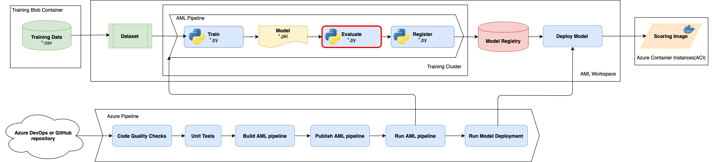

# Challenge 5: Log metrics and model evaluation  

The team really enjoys the production workflow implemented, but find themselves spending a bunch of time going to the Azure DevOps build log and Azure machine learning portal trying to determine whether the newly trained model is performing better than the previous model and if they should deploy this model to their production users.  The team would like to surface the metrics they need to evaluate the training results and automate the evaluation decision to register the model in the Azure ML pipeline.

## Challenge

As a team, complete the following tasks:

1. Measure and log [F1 Score](https://scikit-learn.org/stable/modules/generated/sklearn.metrics.f1_score.html#sklearn.metrics.f1_score) within the model training step.
2. Confirm the captured metric is under a specific run in AML workspace.
    * [Documentation - Monitor Azure ML experiment runs and metrics](https://docs.microsoft.com/en-us/azure/machine-learning/how-to-track-experiments)
3. Add the evaluation step before registering the model with Azure ML workspace. This evaluation step should check for both metrics, F1 Score and AUC(Area Under ROC Curve) metrics and decide whether to register a model or not.
    * Look for the values of pipeline variables ***RUN_EVALUATION*** and ***ALLOW_RUN_CANCEL*** values under .pipelines/[projectname]-variables.yml.

### Success Criteria

To complete this challenge, you must:

* Successfully measure and log F1 Score metric with Azure ML SDK.
* Successfully add an evaluation step before registering a trained ML model. This evaluation step should evaluate the trained ML model based on F1 Score and AUC(Area Under ROC Curve) metric to decide model registration in the register step.
* Discuss the following question with your coach:
    * What are the benefits of evaluating the trained ML model?
