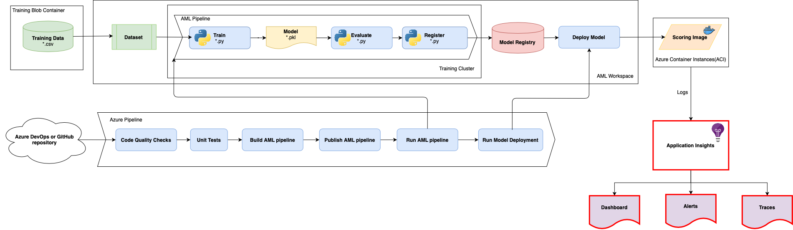

# Challenge 6: Monitoring Deployed Model

The team is pleased with the real-time scoring service deployed to Azure Container Instances (ACI) for their client application to determine if the driver will file a claim.  They've noticed that the client application sometimes responds poorly due to slow or no responses to the service causing business disruptions.  The team would like to observe the service to ensure it is providing valid responses and get alerts when it is performing poorly or down.

## Recommended Reading

* [Documentation - What is Application Insights?](https://docs.microsoft.com/en-us/azure/azure-monitor/app/app-insights-overview)

## Challenge

As a team, complete the following tasks:

1. Start collecting model data (i.e. model inputs and model prediction outputs) from the deployed model. This will be further used to detect data drifts or validate the model ***(data drift detection is not a requirement for this challenge).***
    * [Documentation - Monitor and collect data from ML web service endpoints](https://docs.microsoft.com/en-us/azure/machine-learning/how-to-enable-app-insights)
2. Enable telemetry collection on the ML model web service to measure its performance.
    * Use an **Application Insights** instance attached to your AML workspace as a commonplace to collect all telemetry.
    * [Enabling Application Insights for ACI deployment](https://docs.microsoft.com/en-us/azure/machine-learning/reference-azure-machine-learning-cli)
3. Build visual dashboards where your team can monitor the performance of the web service.
    * [Documentation - Monitor the availability of any website](https://docs.microsoft.com/en-us/azure/azure-monitor/app/monitor-web-app-availability)
4. Configure automated alerts to notify your team members of any performance degradation on the web service.
    * [Documentation - Set Alerts in Application Insights](https://docs.microsoft.com/en-us/azure/azure-monitor/app/alerts)
5. Setup one availability test for the web service to ensure the service is always running and responding.

### Success Criteria

To complete this challenge, you must:

* Successfully see model inputs and predictions in Application Insights traces.
* Successfully configure a chart tile on one of the standard metrics like request rates, response times, and failure rates collected from ML model web service and pined the tile to Azure Dashboard.
* Successfully configure an alert based on the standard metrics like request rates, response times, and failure rates collected from ML model web service that sends an email to the respective team.
* Successfully configure at least one availability test that notifies your team if the ML web service is not responding.
* Discuss with your coach the following questions:
    * What is the benefit of monitoring my ML model web service?
    * What actions can I take based on the telemetry collected from ML model web service?
    * How can I further leverage the model data collected from the deployed model?
