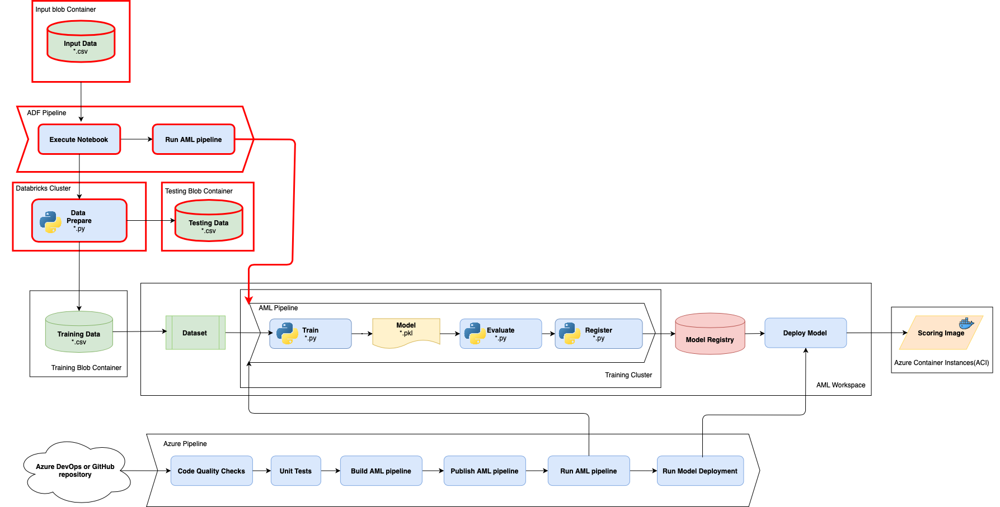

# Challenge 7: Data Ops for ML: Data Ingestion & Pre-processing

The team is overall enjoying the automation and workflow for model training and deployment, but still frustrated with limitations of manual process and no correlation of raw data coming from various sources to train the models. Every time there is an update to the data, it takes sometimes hours to collaborate with the other data team(s) to gain access and then every time manually pre-process, clean, transform, and merge/split the data to be able to train and experiment again.  

The company desires to use of the results of the model predictions to determine policy pricing for their clients in the future.  In order to meet the legal and ethical requirements the company has set to implement the model in this way, they will need to prove the data set and data modifications used specifically to train the model which is making these decisions.  Currently the team has no way to even prove which data set was used, let alone demonstrate the full data lineage for the data used to train the model.

To remove the manual delays (waste) in obtaining and processing new data and demonstrate which data was used to train the model, your team's challenge is to complete and successfully implement the provided partially built ADF data ingestion pipeline.

## Prerequisites

Before starting this challenge, make sure you have the following prerequisite requirements:

* The source data file (porto_seguro_safe_driver_prediction_test.csv)
* [DevOps for Databricks extension](https://marketplace.visualstudio.com/items?itemName=riserrad.azdo-databricks)
* Azure Machine Learning workspace with a training pipeline

## Challenge

As a team, complete the following tasks:

1. Understand the various Data Ingestion options available with Azure services. Discuss pros and cons of the available options.
2. Provision Data Ingestion resources
    * An updated version of the environment_setup/cloud-environment.json ARM template is provided in the **Challenge07** folder of the OpenHack files. This template retains the resources provisioned by the template from MLOpsPython, and additionally provisions an Azure Storage Account with three blob containers (input, training and testing). After replacing the cloud-environment.json, ensure to re-run the pipeline (/environment_setup/iac-create-environment-pipeline-arm.yml).
    * Azure Data Factory workspace and Azure Databricks workspace should be provisioned with ***Infrastructure as Code*** (/environment_setup/iac-create-di-environment.yml) from the **Challenge07** folder of the OpenHack files. This pipeline definition requires two additional variables in the variable group: DATABRICKS_WS_NAME (Databricks workspace name) and DATA_FACTORY_NAME (ADF workspace name).
    * Once the Azure Databricks workspace is provisioned, configure DATABRICKS_ACCESS_TOKEN and STORAGE_ACCOUNT_KEY variables in the variable group.
    * Use ***/environment_setup/iac-prepare-pipelines.yml*** from the **Challenge07** folder of the OpenHack files to automate the following steps:
        * Provision the Databricks cluster
        * Mount all needed containers to the Databricks workspace
        * Create an Azure Data Factory Pipeline to transfer data and invoke the model training pipeline
    The ADF pipeline created by the provisioning pipeline should be considered as a starting point. You are supposed to configure it in this challenge to get it working in your environment.
3. Implement a solution that automatically triggers a data ingestion pipeline to run a Python script when new data drops (i.e. file to a blob store). The Python script should perform the following tasks:
    * Process the data
    * Split the data into training and testing data. The training data is used by the Azure ML training pipeline. The testing data will be used for the final model evaluation which is out of the scope of this challenge
    * Output the data into different containers on the blob store
    * Invoke a model training pipeline

### Hints

* Use the ***Data preparation Python script*** (/dataingestion/data-prepare.py) as a Databricks notebook to transform and split the data.
* Once you've created and published a pipeline in Azure Data Factory, you can associate it with a trigger or manually kick off an ad hoc run. You can monitor all of your pipeline runs natively in the Azure Data Factory user experience. [Visually monitor Azure Data Factory pipelines](https://docs.microsoft.com/en-us/azure/data-factory/monitor-visually)
    * The trigger needs to be activated and then started in the trigger view (separate from the pipeline view!)
* Make sure you use the same experiment name as in the Challenge 4 while invoking an ML pipeline from ADF

### Success Criteria

To successfully complete this challenge, you must:

* Drop an input file (porto_seguro_safe_driver_prediction_test.csv) into the input blob container.
* Automatically start the execution of the ADF pipeline.
* Place the training and testing data files in the corresponding blob containers using the ADF pipeline.
* Automatically invoke the training AML pipeline consuming the training data.
* Discuss the following questions with your coach:
    * What is the benefit of using ADF as a data ingestion orchestrator?
    * How could we implement the data ingestion without ADF using the Databricks cluster?

### Resources

* [Data Ingestion overview](https://docs.microsoft.com/azure/machine-learning/concept-data-ingestion)
* [Data Ingestion with Azure Data Factory](https://docs.microsoft.com/en-us/azure/machine-learning/how-to-data-ingest-adf)
* [Introduction to Azure Data Factory](https://docs.microsoft.com/en-us/azure/data-factory/v1/data-factory-introduction)
* [Azure Databricks Concepts](https://docs.microsoft.com/en-us/azure/databricks/getting-started/concepts#concepts)
* [Databricks File System](https://docs.databricks.com/data/databricks-file-system.html)
* [Run a Databricks notebook with the Databricks Notebook Activity in Azure Data Factory](https://docs.microsoft.com/en-us/azure/data-factory/transform-data-using-databricks-notebook)
* [Execute Azure Machine Learning pipelines in Azure Data Factory](https://docs.microsoft.com/en-us/azure/data-factory/transform-data-machine-learning-service)
* [Azure Container Registry authentication with service principals](https://docs.microsoft.com/en-us/azure/container-registry/container-registry-auth-service-principal)
* [Data Access in Azure Machine Learning](https://docs.microsoft.com/en-us/azure/machine-learning/concept-data)
