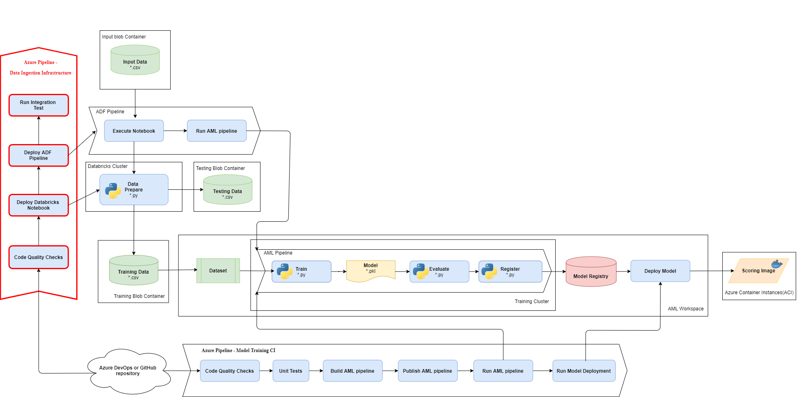

# Challenge 8: Data Ops for ML: CI/CD Pipelines as Code

The team is so pleased with the efficiency of the ADF solution implemented, a number of others have been extending the functionality to pull in other data sources and steps to modify the data ingestion pipeline. This has caused some problems when multiple people try to make conflicting changes at the same time, causing the pipeline to break. There is no way to compare or review the changes and ensure it doesn't break the training pipeline.

The team needs to fully automate the data ingestion pipeline changes from their dev/QA environments all the way to production data sources since they are not allowed to have access to these data sources and have to comply with audit requirements.

To address these challenges, we will configure source code management with branch policies and CI/CD pipelines to deploy the data ingestion solution across environments (see figure below).

## Recommended Reading

* [CI/CD for a Data Ingestion pipeline](https://docs.microsoft.com/azure/machine-learning/how-to-cicd-data-ingestion)
* [Continuous integration and delivery in Azure Data Factory](https://docs.microsoft.com/azure/data-factory/continuous-integration-deployment#overview)

## Prerequisites

Before starting this challenge, make sure you have the following prerequisite requirements:

* A data ingestion pipeline from the previous challenge
* A new target (QA) environment consisting of:
    * Azure Data Factory workspace
    * Azure Databricks workspace

For simplicity you can reuse the storage account and AML workspace (with a published ML pipeline) from the previous challenges in the QA environment (see figure below).

Provision the QA resources (Azure Data Factory workspace and Azure Databricks workspace) following the same procedure as in the **Challenge07** but with a new variable group.

* Clone ***devopsforai-aml-vg*** variable group and rename it to ***devopsforai-aml-qa-vg*** so that it contains values for your QA environment. Reconfigure values for DATABRICKS_WS_NAME and DATA_FACTORY_NAME variables (e.g. add **-qa** postfix)

* Provision the Azure Data Factory and Azure Databricks workspaces with a new pipeline created from ***Infrastructure as Code*** (/environment_setup/iac-create-di-environment.yml) from the **Challenge07** folder of the OpenHack files. This pipeline ***must get the variables from the QA devopsforai-aml-qa-vg*** variable group.
* Once the Azure Databricks workspace is provisioned, reconfigure the DATABRICKS_ACCESS_TOKEN variable in the ***devopsforai-aml-qa-vg*** variable group.
* Use ***/environment_setup/iac-prepare-pipelines.yml*** from the **Challenge07** folder of the OpenHack files to automate the following steps:
    * Provision the Databricks cluster in QA Databricks workspace
    * Mount all needed containers to the QA Databricks workspace
    * Create an Azure Data Factory Pipeline to transfer data and invoke the model training pipeline

    The pipeline must get the variables from the QA ***devopsforai-aml-qa-vg*** variable group.

## Challenge

As a team, complete the following tasks:

1. Have the source code of the data ingestion solution stored in a source code repository (git). Discuss and standardize a branching policy for the data pipeline and the notebooks.
2. Implement CI/CD pipelines deploying the data ingestion pipeline and the notebooks to the target environment.
    * Use ***Invoke-ADFPipeline.ps1*** (/adf/utils/Invoke-ADFPipeline.ps1) to run an ADF pipeline
    * Use ***test-data-ingestion.py*** (/code/dataingestion/test-data-ingestion.py) to check if the data is ingested/transformed correctly
    * Make sure ***arm-template-parameters-definition.json*** (/adf/resources/arm-template-parameters-definition.json) file is in the ADF source code folder

### Success Criteria

To successfully complete this challenge, you must demonstrate:

* Source control management of the data ingestion pipeline including the data preparation Python code.
* The ability to work with the source code as a team following a branching policy.
* Azure DevOps CI/CD pipelines deploying the whole data ingestion pipeline to the target environment. Have the solution parametrized so it can be deployed to multiple environments.
    * Lint the Python code
    * Deploy an ADF pipeline and the Python data preparation code
    * Test run of the deployed ADF pipeline
    * Integration test checking if the data is ingested/transformed correctly
* Azure DevOps CI/CD pipelines stored in a source code repository (git)
* Dropping an input file to the input blob container will automatically start the pipeline execution, transfer the data, and invoke AML training pipeline
* Discuss the following questions with your coach:
    * In real life you often have more environments in a chain (e.g. Dev-QA-UAT-Prod.)
        * How would you extend the CI/CD pipeline to deploy the data ingestion solution to all environments?
        * Would you automatically do the test run of the data ingestion pipeline in the PROD environment? If so, then how?
    * The ADF pipeline invokes a published ML pipeline by id. How would you pass the value of the ML pipeline id to the ADF, given that it changes every time when the ML pipeline is published and given that normally ADF and ML pipelines are maintained by separate teams?
    * How could you speed up the CI/CD execution?
    * How could you implement unit tests for the data preparation code?
    * How would you configure CI/CD triggering on a change in the data preparation code and a change in the ADF pipeline?

### Resources

* [Azure Databricks Extension](https://github.com/microsoft/azdo-databricks)
