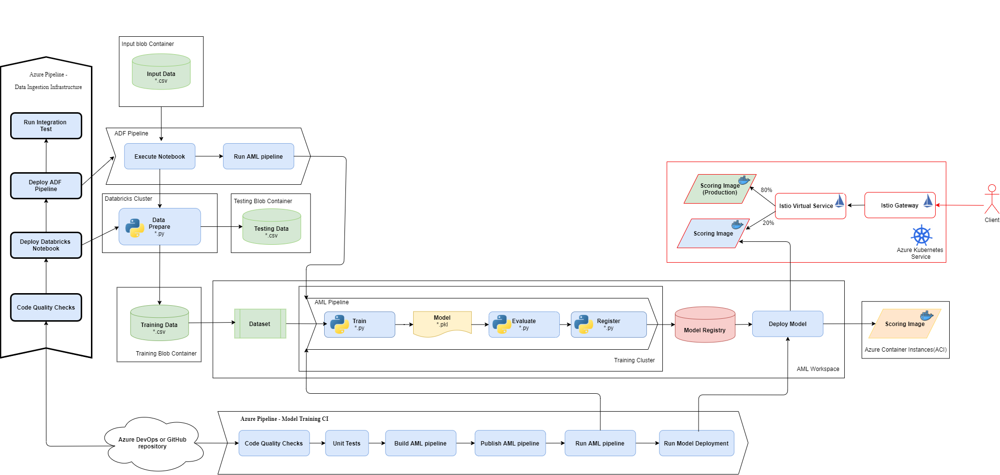

# Challenge 9: Advanced: Canary deployment

The deployed model is successfully helping the business make wise decisions for their policies and clients. They would like to make more investments to improve the accuracy and logic as the business and data evolves. The scientists and engineers would like to provide a way to compare the results of a proposed updated model against the existing production model via live production data while minimizing disruption to the business.

To address these challenges, the team will deploy a scoring image with a ***canary*** deployment strategy on a Kubernetes environment with an Istio service mesh implementation.

## Recommended Reading

* [Model deployment to AKS cluster with Canary deployment](https://github.com/microsoft/MLOpsPython/blob/master/docs/canary_ab_deployment.md)
* [Quickstart: Deploy an Azure Kubernetes Service cluster using the Azure CLI](https://docs.microsoft.com/en-us/azure/aks/kubernetes-walkthrough)

## Prerequisites

Before starting this challenge, make sure you have the following prerequisite requirements:

* AML Workspace with a registered model from previous challenges
* Container Registry to store scoring images

## Challenge

As a team, complete the following tasks:

1. Set up your Kubernetes cluster:
    * Use the [Quickstart: Deploy an Azure Kubernetes Service cluster using the Azure CLI](https://docs.microsoft.com/en-us/azure/aks/kubernetes-walkthrough) guide to set up your cluster.
      * Use your existing resource group.
      * You can stop after the cluster creation and skip the creation of the sample application.
    * Configure your AKS cluster to use Istio with the following guide: [Install and use Istio in Azure Kubernetes Service (AKS)](https://docs.microsoft.com/azure/aks/servicemesh-istio-install?pivots=client-operating-system-linux)
      * Consider storing any manually created secrets in your resource group's KeyVault for future reference.
    * Create a namespace named 'abtesting' for the exercise and enable [Istio automatic sidecar injection](https://archive.istio.io/v1.4/docs/setup/additional-setup/sidecar-injection/) on it.
    * In order for the cluster to use your Azure Container Registry, you need to authenticate to it from your cluster. Follow the guide for your existing cluster at: [Authenticate with Azure Container Registry from Azure Kubernetes Service](https://docs.microsoft.com/en-us/azure/aks/cluster-container-registry-integration#configure-acr-integration-for-existing-aks-clusters)
2. Setup a CI/CD solution deploying a scoring image to a Kubernetes cluster with Canary deployment strategy.
    * Follow the [Model deployment to AKS cluster with Canary deployment](https://github.com/microsoft/MLOpsPython/blob/master/docs/canary_ab_deployment.md) guide to complete the challenge.
    * The pipeline will revert failed deployments automatically. If you need to debug your deployment before reverting, [create an environment](https://docs.microsoft.com/en-us/azure/devops/pipelines/process/environments?view=azure-devops) named 'abtestenv' and configure its 'Approval and Checks' settings to require signoff at each stage.
3. Understand the % of traffic deployed to each model via the Azure DevOps pipeline and test via the scoring endpoint.
   * For the purpose of this challenge, you can use a dummy scoring file so that you can easily identify a scoring image version by the response

### Success Criteria

To successfully complete this challenge, you must demonstrate:

* An Azure DevOps pipeline deploying a scoring image to a K8s cluster
* Two scoring containers (old and new) working simultaneously on the K8s cluster
* One scoring endpoint routing user requests to the old and then new scoring containers according to the weights
* That the deploying pipeline updates the routing weights in multiple stages
* ***Stretch Goal***: That the canary deployment pipeline works with the actual safe driving scoring images from the previous challenges

### Further Exploration

After completing this challenge, consider performing the following activities:

* Analyze the service mesh behavior in the Kiali console
* Enable Istio resources to send direct requests to either old or new scoring containers. For example, depending on a keyword in the request header.

### Resources

* [AML SDK. Image package](https://docs.microsoft.com/python/api/azureml-core/azureml.core.image?view=azure-ml-py)
* [Multi-stage pipelines user experience](https://docs.microsoft.com/azure/devops/pipelines/get-started/multi-stage-pipelines-experience?view=azure-devops)
* [Create and target an environment](https://docs.microsoft.com/en-us/azure/devops/pipelines/process/environments?view=azure-devops)
* [Istio. Request Routing](https://istio.io/docs/tasks/traffic-management/request-routing/)
* [Istio. Automatic sidecar Injection](https://istio.io/docs/setup/additional-setup/sidecar-injection/#automatic-sidecar-injection)
* [Kiali. Service mesh observability](https://kiali.io)
* [Helm](https://helm.sh)
